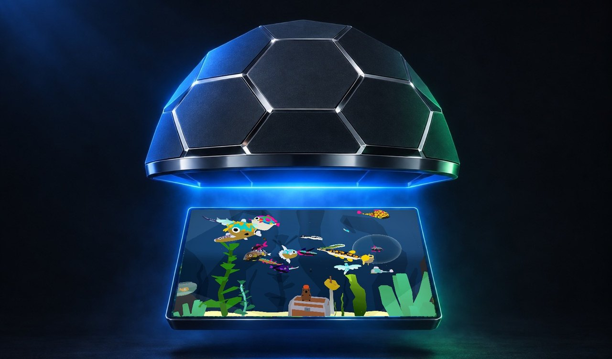
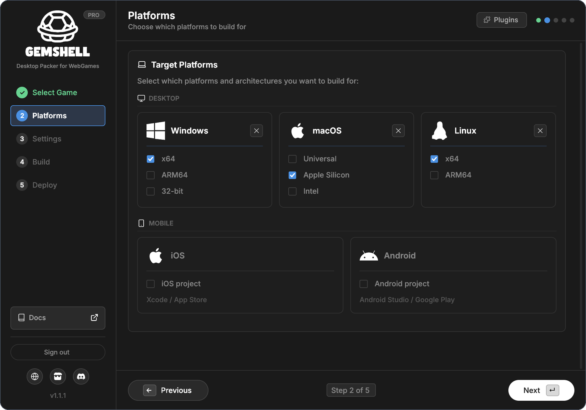
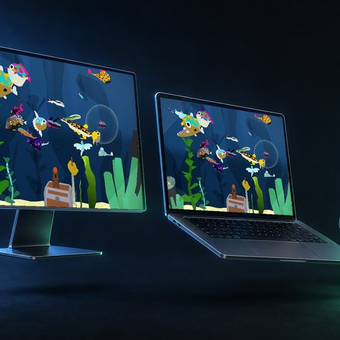
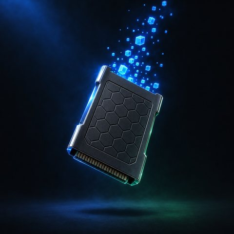

<!-- The README of eddime/GemShell. The release workflow fills in 1.1.1 and
     puts it there with every release; edit it here, not there. -->

<picture>
  <source media="(prefers-color-scheme: dark)" srcset="assets/logo-dark.svg">
  
</picture>

### Web game in. Real app out.

Package your HTML5 game as a real app for **Windows, macOS, Linux, iOS and Android**, 
with **Steamworks** in plain JavaScript and **one-click deploy** to Steam, itch.io and GitHub.

For Construct · GDevelop · RPG Maker · Phaser · Three.js · PixiJS · any HTML5 export

 

 

 

## Three steps. The last one is a button.

| | |
|:---:|---|
| **01** | **Open the folder** — the one with your `index.html` in it. Nothing moves, nothing gets added to your project. |
| **02** | **Tick the platforms** — name, icon, window, your Steam App ID. Everything else already has an answer. |
| **03** | **Press build** — every platform at once, and one more press puts them on Steam, itch.io and GitHub. |

  

## Your engine exports the game. GemShell ships it.

<table>
<tr>
<td width="50%" valign="top">

### Steamworks in one line of JavaScript
137 Steamworks calls in 23 areas as one global `steam` object — achievements, stats, cloud saves, leaderboards, lobbies, P2P, the overlay, Workshop and more. No SDK to link, no C++, nothing to compile per platform.

</td>
<td width="50%" valign="top">

### Your assets, locked in
Every file goes into one encrypted bundle, with a new key for every build, held inside a compiled program. Unzip the app and there is nothing worth taking.

</td>
</tr>
<tr>
<td width="50%" valign="top">

### One build. Every screen.
Windows `.exe`, macOS `.app`, Linux, an Xcode project and an Android Studio project, built side by side from whichever machine you are sitting at.

</td>
<td width="50%" valign="top">

### Set it up once. Ship with one click.
Steam (depots, branches, the VDF written for you), itch.io (a channel per platform) and GitHub (a tagged release) — all in the same press.

</td>
</tr>
</table>

## Free to try. One payment to ship.

| | **Lite** — free | **Pro** — $29.95, yours for good |
|---|:---:|:---:|
| Windows, macOS, Linux | ✓ | ✓ |
| GemShell API & asset encryption | ✓ | ✓ |
| Steamworks | Valve's test app (480) | **your own App ID** |
| iOS & Android | | ✓ |
| Custom icon, no splash screen | | ✓ |
| One-click deploy & plugins | | ✓ |

  

## Download

Everything for **GemShell 1.1.1** is on the [release page](https://github.com/eddime/GemShell/releases/tag/v1.1.1):

| System | File |
|---|---|
| Windows 10 / 11 | [`GemShell-1.1.1-windows-x86_64.msi`](https://github.com/eddime/GemShell/releases/download/v1.1.1/GemShell-1.1.1-windows-x86_64.msi) |
| macOS, Apple Silicon | [`GemShell-1.1.1-macos-arm64.dmg`](https://github.com/eddime/GemShell/releases/download/v1.1.1/GemShell-1.1.1-macos-arm64.dmg) |
| macOS, Intel | [`GemShell-1.1.1-macos-x86_64.dmg`](https://github.com/eddime/GemShell/releases/download/v1.1.1/GemShell-1.1.1-macos-x86_64.dmg) |
| Debian, Ubuntu | [`gemshell_1.1.1_amd64.deb`](https://github.com/eddime/GemShell/releases/download/v1.1.1/gemshell_1.1.1_amd64.deb) · [`arm64`](https://github.com/eddime/GemShell/releases/download/v1.1.1/gemshell_1.1.1_arm64.deb) |
| Any Linux | [`AppImage x86_64`](https://github.com/eddime/GemShell/releases/download/v1.1.1/GemShell-1.1.1-linux-x86_64.AppImage) · [`arm64`](https://github.com/eddime/GemShell/releases/download/v1.1.1/GemShell-1.1.1-linux-arm64.AppImage) |

GemShell updates itself once it is installed. The builds are not code-signed: on macOS, open the app the first time with right-click → **Open**.

 

**[Docs](https://gemshell.dev/guide/getting-started)** · **[Steamworks API](https://gemshell.dev/api/steamworks)** · **[Changelog](https://l0om.itch.io/gemshell/devlog)** · **[Discord](https://discord.com/invite/b24q5B8ZAY)** · **[gemshell.dev](https://gemshell.dev)**

Built for indie devs, by one.

